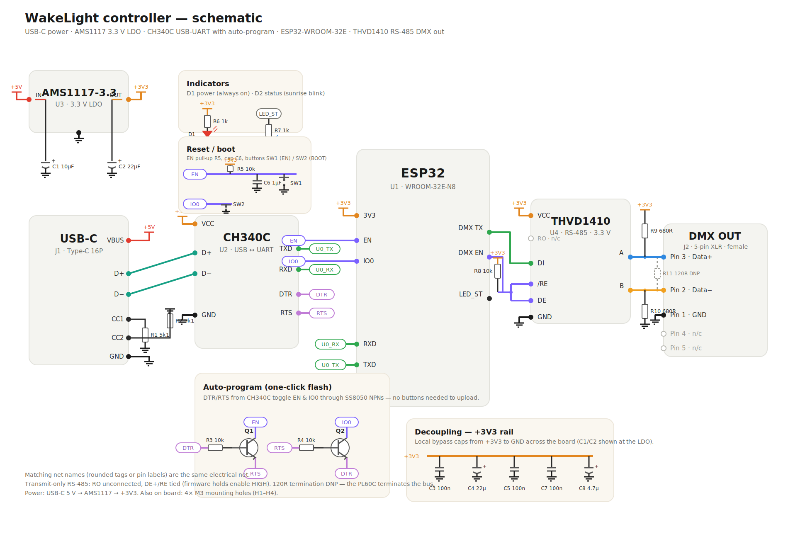
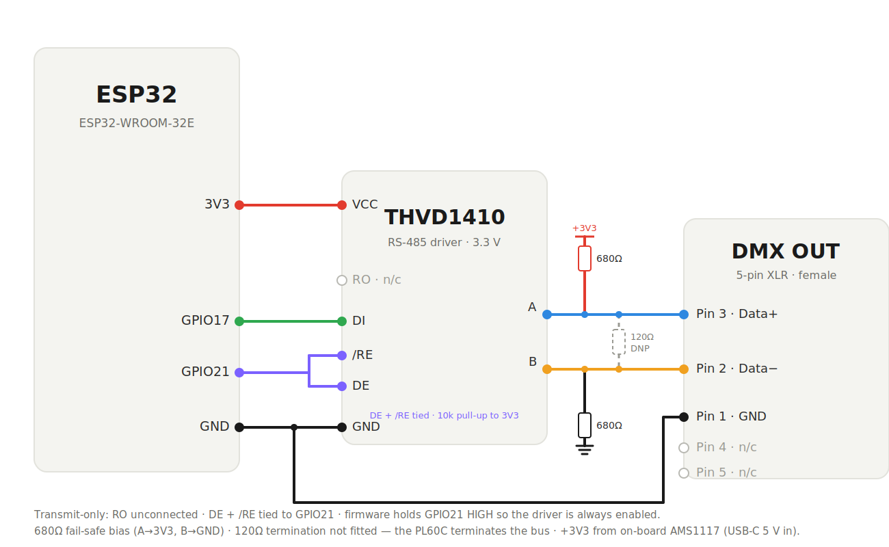

# WakeLight — DMX sunrise controller for the Neewer PL60C

An ESP32 that plugs into the PL60C's 5-pin DMX-IN and ramps it from black to
full daylight before your alarm, configured from a phone-friendly web portal
on your home Wi-Fi.

```
[USB 5V] → [ESP32] → [3.3V RS-485 driver] → [female 5-pin XLR] → PL60C DMX-IN
              ↑ Wi-Fi: http://wakelight.local
```

The custom PCB (v1.1, 66 × 42 mm) carries a PCB-mount Neutrik NC5FAH female
XLR on its edge, so any standard male→female 5-pin DMX lead connects the box
to the lamp directly. The earlier screw-terminal variant is archived in
`hardware/pcb/v1.0-terminal/`.

## Schematic



The whole board: USB-C 5 V → AMS1117 3.3 V LDO, a CH340C USB-UART with the
classic SS8050 DTR/RTS auto-program circuit (one-click flashing — no buttons),
the ESP32-WROOM-32E, and the THVD1410 RS-485 output stage. EN/boot have the
usual pull-up, cap and tact switches; every supply pin is locally decoupled.
Matching net-name tags denote the same electrical net.

### DMX output stage (detail)



The output stage is **transmit-only**: the THVD1410's receiver output (RO) is
left unconnected, and DE + /RE are tied to GPIO21 — which the firmware holds
HIGH so the driver is always enabled. A 680 Ω fail-safe bias pair (A→3V3,
B→GND) keeps the idle bus in a defined state; the 120 Ω termination footprint
is left unpopulated (DNP) because the PL60C terminates the far end. Everything
runs from the on-board AMS1117 3.3 V rail (USB-C 5 V in). Full rationale in
`docs/rs485-design-notes.md`.

## What's here

| Path | What |
|---|---|
| `orders/ORDER_THIS_WEEK.md` | **Start here** — click-to-order shopping lists (modules now, PCB fab) |
| `hardware/module-build/BUILD_GUIDE.md` | Devkit + breakout wiring, 20-min assembly |
| `hardware/pcb/` | Custom PCB: KiCad board (DRC-clean), `wakelight_gerbers.zip`, JLCPCB BOM + CPL, renders |
| `firmware/` | PlatformIO project — compiles clean, same pinout for both builds |
| `docs/dmx-profile.md` | PL60C official DMX channel map + lamp setup steps |
| `docs/rs485-design-notes.md` | Why the output stage is built the way it is |

## How it works

- **DMX**: continuous 40 Hz refresh of a 513-slot universe from a dedicated
  FreeRTOS task (esp_dmx, hardware UART — Wi-Fi can't jitter it). The PL60C's
  native profile is driven in CCT mode: mode-select channel, brightness,
  colour temperature (2500–10000 K), G/M tint.
- **Sunrise**: two-phase dawn — a slow cubic glow from black at 2500 K up to
  10%, then brightness + CCT sweep to your configured daylight, hitting 100%
  exactly at alarm time. Stays on for a configurable hold, then off.
- **Portal**: per-day alarms, ramp length, sunrise colour shaping, manual
  brightness/CCT/HSI control, 2-minute demo button, fixture settings.
  mDNS at `http://wakelight.local`.
- **Time**: NTP with proper Europe/London DST rules. No RTC needed.
- **Provisioning**: first boot opens Wi-Fi AP `WakeLight-Setup`
  (password `sunrise123`) with a captive portal for your home Wi-Fi.

## Quick start (once parts arrive)

1. `cd firmware && pio run -t upload` with the ESP32 on USB
2. Wire per the build guide; plug XLR into the lamp's **DMX-IN**
3. On the lamp: long-press MODE/MENU → DMX → ON, DMX ADDR → 001
4. Join `WakeLight-Setup`, give it your Wi-Fi, open `http://wakelight.local`
5. Tap **2-min sunrise demo** — the panel should dawn from nothing
6. Set your alarms. Done.

## Pinout (both builds)

| ESP32 | Function |
|---|---|
| GPIO17 | DMX TX → transceiver DI |
| GPIO21 | transceiver DE + /RE (driver always enabled) |
| GPIO2 | status LED (blinks during sunrise) |
| 5-pin XLR | 1 = GND, 2 = Data−, 3 = Data+, 4/5 unused |
