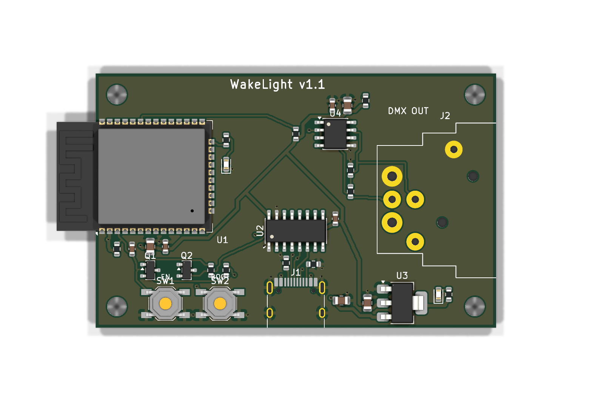
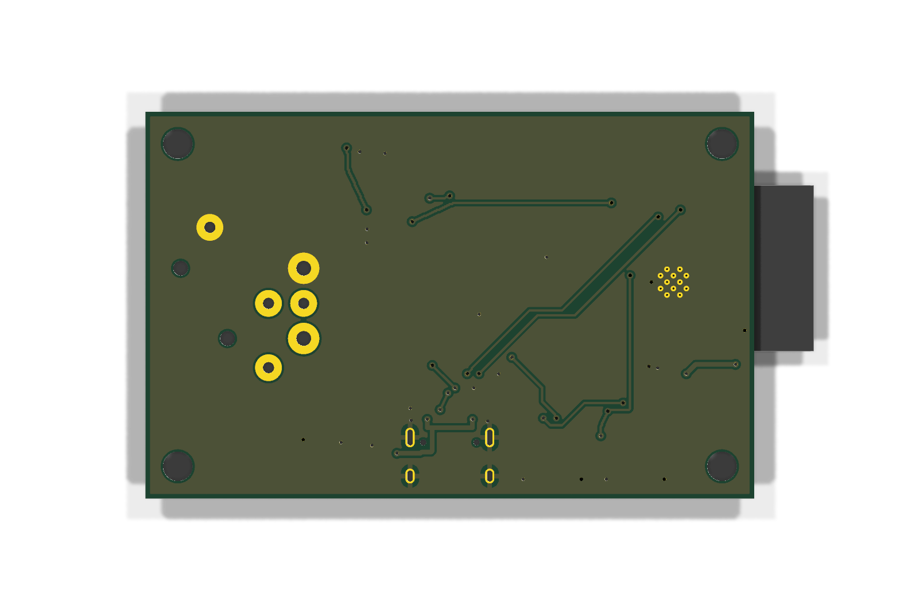

# TheBetterWakelight

Two independent takes on the same idea: an **ESP32-based DMX sunrise
controller for the Neewer PL60C**. The ESP32 plugs into the lamp's 5-pin
DMX port and ramps it from black to full daylight before your alarm,
configured from a phone-friendly web portal on your home Wi-Fi.

```
phone ──WiFi──▶ ESP32 ──DMX-512──▶ Neewer PL60C
        http://wakelight.local/
```

Each version is fully self-contained in its own folder — separate firmware,
docs and build setup. Pick whichever you want to build.

## [`v1-dmx-wakelight/`](v1-dmx-wakelight/) — the original build

The first working version. ESP-IDF / PlatformIO firmware that drives the
PL60C over DMX-512 on a configurable, **waypoint-based** sunrise ramp, with a
mobile web UI for schedule setup and real-time control. Mixes interpolated
brightness/colour-temperature waypoints with the PL60C's 17 named special
effects. Includes wiring schematics and helper scripts.

→ [Read the v1 README](v1-dmx-wakelight/README.md)

## [`v2-better-wakelight/`](v2-better-wakelight/) — the better wakelight

The refined product. A purpose-built **custom PCB** (Neutrik 5-pin XLR,
USB-C power, CH340C one-click flashing, THVD1410 RS-485 output stage) plus
firmware and a Wi-Fi setup portal. Ships hardware deliverables — KiCad
project, schematics, enclosure STLs and order files.

| Custom PCB — XLR variant (top) | Bottom |
|:---:|:---:|
|  |  |

→ [Read the v2 README](v2-better-wakelight/README.md) ·
[original project brief](v2-better-wakelight/BRIEF.md)

---

Build artifacts (PlatformIO/ESP-IDF output, KiCad caches, generated meshes,
Wi-Fi secrets) are gitignored per-folder.
