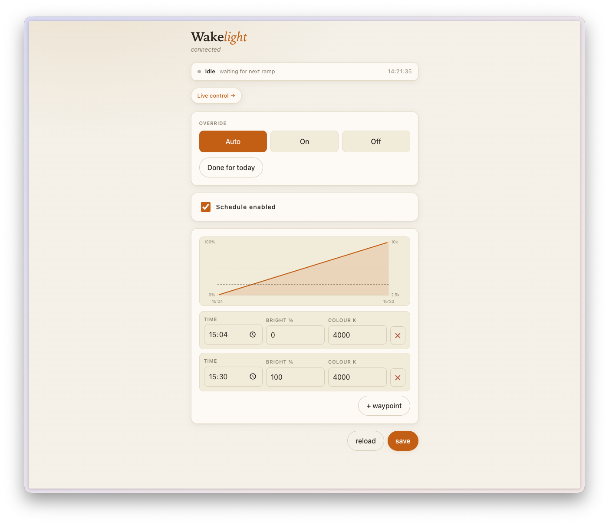
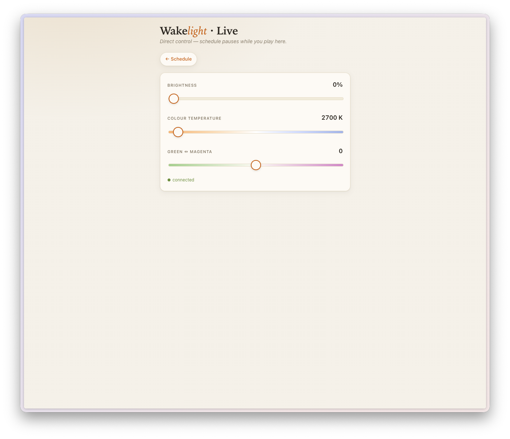

# Wakelight

A DMX-controlled wake-up light. An ESP32 drives a Neewer PL60C
(or any single-fixture DMX-512 channel) on a configurable sunrise ramp
each morning, with a small mobile-friendly web UI for setup and
real-time control.

```
phone ──WiFi──▶ ESP32 ──DMX-512──▶ PL60C
        http://wakelight.local/
```

## What it does

<p align="center">
  
  &nbsp;&nbsp;
  
</p>

### Schedule (`/`)

A ramp is defined by an ordered list of **waypoints**. Two flavours,
mixable in a single schedule:

- **Light** waypoints (💡): time of day, brightness %, colour temperature
  in kelvin. Adjacent Light waypoints linearly interpolate (in DMX-byte
  space, so fades are smoother than 1%-step quantisation would give you).
- **Effect** waypoints (✨): time of day, brightness %, plus one of the
  PL60C's 17 named special effects (Lightning, Cop car, Candlelight,
  Fireworks, …) with effect-specific parameters. Effect waypoints don't
  interpolate — they fire at their time and hold the effect until the
  next waypoint.

Mixed segments (Light → Effect, Effect → anything) hold the start
waypoint's state until the next waypoint's time. Past the last waypoint,
the lamp **holds at those values** until either:

- you press *Done for today* (terminal — see below), or
- the calendar rolls past midnight, or
- you save a new schedule whose first waypoint is in the future.

The schedule is stored in NVS so it survives power cycles.

The *link times* toggle (🔗 above the waypoint list) shifts every
other waypoint by the same delta when you change one — handy for
nudging the whole ramp forward or back without re-entering each row.
The *default ramp* button reseeds a five-point morning curve as a
starting point. *+ light* / *+ effect* add a new waypoint of either
type.

> **Effect waypoints require Mode 3 on the lamp.** The PL60C must be
> physically set to Mode 3 (FX, 9-channel) on its menu for FX bytes to
> apply — Mode 1 (CCT, 4-channel) ignores the higher slots so FX
> waypoints silently produce no light. Light waypoints work in either
> mode.

### Override buttons

Three pill buttons sit above the schedule:

- **Auto** — follow the schedule (default)
- **On** — force 100 % at 4000 K
- **Off** — force the lamp dark

Override is in-memory only; a power cycle resets to Auto.

### Done for today

A one-shot button below the override row. Pressing it suppresses the
schedule for the rest of the local day. **There is no resume.** It
persists to NVS, so a reboot before midnight still keeps the lamp off.
At local midnight the date comparison auto-clears it for tomorrow's
ramp.

If you save a new schedule whose first waypoint is later than the
current time, the dismiss is automatically dropped — assumed-intent
that the new ramp should fire.

### Live control (`/live`)

A separate page with three sliders driven over a WebSocket:

- **Brightness** 0–100 %
- **Colour temperature** 2500–10000 K (warm-to-cool gradient track)
- **Green ↔ Magenta** −100 to +100 (G/M tint, 0 = neutral)

When you move a slider the firmware switches into a `MANUAL` mode and
pushes the new DMX frame immediately (~30 ms throttle on the wire).
**Closing the tab does not revert the lamp** — manual values stay until
you explicitly hit Auto/On/Off on the schedule page. Re-opening the
Live page seeds the sliders from the lamp's current effective state.

### Multiple lamps

Each device derives an mDNS hostname from its friendly name (e.g.
"Bedroom" → `bedroom.local`). On boot it probes the LAN; if the slug
is already taken by another wakelight it falls back to `slug-2`,
`slug-3`, …, and ultimately to a MAC-derived `wakelight-XXXX` that's
guaranteed unique.

The first lamp to come up also claims `wakelight.local` as a delegate
hostname. Hitting `http://wakelight.local/` from anywhere on the LAN
serves a picker that lists every lamp it can see and links through
to each one's slug URL. Discovery is via a `_wakelight._tcp` mDNS
service whose TXT records carry `name` and `slug`.

Rename a lamp from the *This lamp* card on the schedule page. The
firmware probes the new slug for clashes and returns 409 if another
wakelight is already using it. Names persist in NVS.

### Status pill

Top of the schedule page, polled every 5 s:

| State | Meaning |
|---|---|
| Ramping (pulsing) | Interpolating between two waypoints |
| Holding | Past the last waypoint, lamp held |
| Manual | Live sliders are driving |
| On / Off | Override is active |
| Dismissed | Done for today, schedule paused |
| Idle | Before today's first waypoint |
| No time | SNTP hasn't synced yet |

### Graph

Read-only SVG preview of the ramp on the schedule page. Brightness as
a filled curve (terracotta), CCT as a dashed line, dot at each
waypoint coloured by its CCT. Driven entirely by the waypoint table —
not editable from the graph.

## Architecture

```
┌──────────────┐                          ┌──────────────┐
│ index.html   │  GET  /api/schedule      │  schedule    │  ◀─NVS
│ live.html    │  PUT  /api/schedule      │  (waypoints) │
│ picker.html  │  GET  /api/status (5s)   ├──────────────┤
│              │  POST /api/override      │  override    │
│ (gzipped     │  POST /api/dismiss       │  (atomic)    │
│  & embedded  │  GET  /api/device        ├──────────────┤
│  in flash)   │  PUT  /api/device        │  dismiss     │  ◀─NVS
│              │  GET  /api/peers         │  (atomic)    │
│              │  WS   /ws/live           ├──────────────┤
└──────────────┘                          │  device_id   │  ◀─NVS
                                          │  (name+slug) │
                                          └──────────────┘
                                                  │
                                                  ▼ 1 Hz
                                          ┌──────────────┐
                                          │  ramp_task   │
                                          │  resolves to │
                                          │  (b, k, gm)  │
                                          └──────────────┘
                                                  │
                                                  ▼
                                          ┌──────────────┐  30 ms
                                          │  dmx_tx task │ ────▶ DMX wire
                                          └──────────────┘
```

The ramp task is the single decision point. Every second it reads the
override mode, the dismiss flag and the schedule, and resolves them to
a `(brightness_byte, cct_k, gm_byte)` triple that the DMX sender task
keeps pumping at 33 Hz.

See `docs/audit` (or grep for `ramp_task` in [src/main.c](src/main.c))
for a full state machine.

## Hardware

- **MCU**: ESP32 dev board (any with at least 1 MB app partition)
- **DMX driver**: an RS-485 transceiver wired to GPIO 17 (TX), GPIO 16
  (RX), GPIO 4 (DE/RE)
- **Fixture**: Neewer PL60C, address **`1`**. Use **Mode 1 (CCT,
  4-channel)** for plain ramps or **Mode 3 (FX, 9-channel)** if you
  also want effect waypoints — Mode 3 still serves CCT correctly via
  the same slot ordering. Mode/address selection lives in
  [src/dmx_out.c](src/dmx_out.c) (`FIXTURE_ADDR`, `FX_MODE_BYTE`).
  Other 4-channel CCT fixtures with the same slot order (mode /
  brightness / CCT / G-M) should work unchanged for Light-only
  schedules.

## Setup

### 1. Toolchain

[PlatformIO](https://platformio.org/) does the heavy lifting; install
it however you like (VS Code extension, `brew install platformio`,
`pip install platformio`, …).

### 2. WiFi credentials

```bash
cp src/wifi_secrets.h.example src/wifi_secrets.h
# edit src/wifi_secrets.h with your SSID + password
```

`src/wifi_secrets.h` is gitignored.

### 3. Build & flash

```bash
pio run -e wakelight -t upload
```

First boot the ESP joins WiFi, syncs SNTP from `pool.ntp.org` (London
TZ with auto DST is hard-coded — change `setenv("TZ", ...)` in
[src/wifi_sntp.c](src/wifi_sntp.c) if you're elsewhere), advertises
itself on mDNS at `wakelight-<MAC4>.local` (or your chosen slug, see
[Multiple lamps](#multiple-lamps)), opportunistically claims
`wakelight.local` as a delegate, and the schedule loads from NVS (or
seeds with a default morning ramp on a fresh device).

### 4. Open the UI

On a phone connected to the same WiFi:

- `http://wakelight.local/` — picker that lists every lamp on the
  network and links through to its schedule page
- `http://<slug>.local/` — schedule page for that lamp directly
- `http://<slug>.local/live` — live sliders

If mDNS doesn't resolve on your network, the IP shows up in the serial
log on boot — use that instead.

### 5. Logs

A small Python helper tails serial in the background and writes to
`logs/serial.log`:

```bash
python3 scripts/serial_tail.py
```

Default log level is **WARN** (chosen for size — see *Footprint*
below). Bump `CONFIG_LOG_DEFAULT_LEVEL_INFO=y` in
[sdkconfig.wakelight](sdkconfig.wakelight) for verbose boot output.

## Footprint

The firmware is intentionally lean: ~750 KB on a 1 MB app partition
(72 % used). Choices that matter:

- `-Os` with silent assertions
- newlib-nano formatter (no float `printf`)
- IPv6 + mbedtls cert bundle disabled
- HTML embeds gzip-compressed and served with `Content-Encoding: gzip`
- mDNS, RDM (in `esp_dmx`) kept on; both are candidates if you ever
  need more headroom

DMX timing requires `CONFIG_DMX_ISR_IN_IRAM=1` (already set as a
build flag in [platformio.ini](platformio.ini)) — without it, WiFi's
flash-cache disables corrupt DMX frames around association.

## Repository layout

```
src/
  main.c            boot + 1 Hz ramp task
  dmx_out.{c,h}     DMX driver wrapper, atomic packed setpoint
  schedule.{c,h}    waypoint model, NVS persistence, interpolation
  override.{c,h}    auto/on/off/manual mode + manual values
  dismiss.{c,h}     "done for today", date-anchored, NVS-persisted
  device_id.{c,h}   friendly name → slug, MAC-derived fallback, NVS
  wifi_sntp.{c,h}   STA join + London TZ + SNTP
  http_ui.{c,h}     HTTP server, /api endpoints, WebSocket, mDNS
  index.html        schedule page (gzipped at build time)
  live.html         live slider page (gzipped at build time)
  picker.html       served at wakelight.local; lists discovered peers
  wifi_secrets.h.example   copy → wifi_secrets.h, gitignored
scripts/
  gen_index_html.py prebuild: gzip + embed HTML into C
  serial_tail.py    serial logger
sdkconfig.wakelight pruned IDF config
platformio.ini      build environments
info/               vendor docs (PL60C DMX command table)
```

## Common adjustments

| Want | Change |
|---|---|
| Different timezone | `setenv("TZ", ...)` in [src/wifi_sntp.c](src/wifi_sntp.c) |
| Different fixture address | `FIXTURE_ADDR` in [src/dmx_out.c](src/dmx_out.c) |
| Different DMX pins | `TX_PIN`, `RX_PIN`, `EN_PIN` in [src/dmx_out.c](src/dmx_out.c) |
| Different ON-button defaults | `OVERRIDE_ON_BYTE`, `OVERRIDE_ON_CCT` in [src/main.c](src/main.c) |
| More waypoints per schedule | `SCHEDULE_MAX_POINTS` in [src/schedule.h](src/schedule.h) |
| Faster ramp recompute | `period` in `ramp_task` ([src/main.c](src/main.c)) — note the 8-bit DMX byte caps perceptible smoothness regardless |
