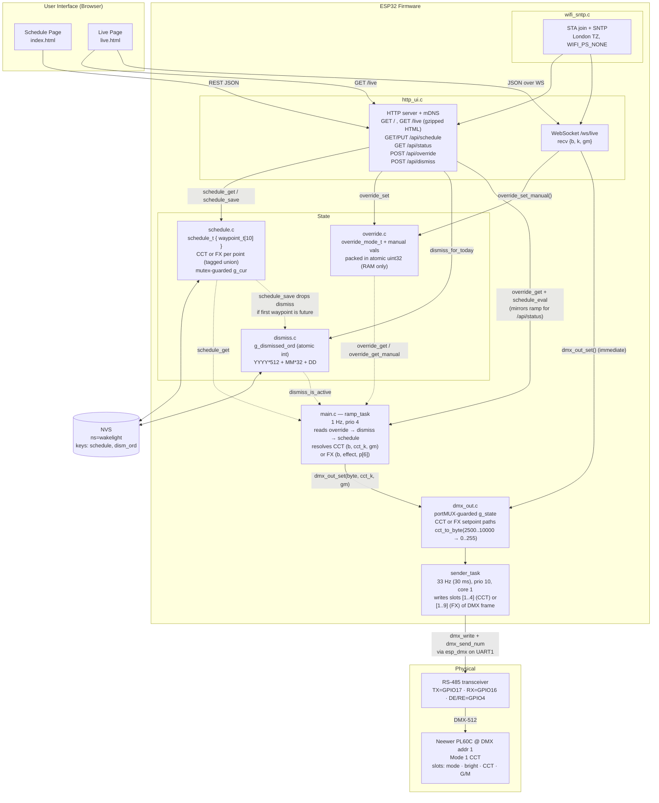

## Firmware architecture

### Notes grounded in the code

- **Single decision point.** [`ramp_task`](../src/main.c) runs at 1 Hz and is the only
  path that translates override + dismiss + schedule into a DMX set point
  under `AUTO`. `MANUAL` and `ON`/`OFF` short-circuit earlier in the same
  task.
- **WS bypass for latency.** [`live_ws_h`](../src/http_ui.c) calls
  `dmx_out_set()` directly after `override_set_manual()` so slider moves
  don’t wait for the 1 Hz tick. The next `ramp_task` tick then repaints
  the same values from the atomic override state.
- **Atomic + spinlock for setpoints.** `override.c` packs mode + manual
  (brightness_pct, cct_k, gm_byte) into one `_Atomic uint32_t`. `dmx_out.c`
  uses a `portMUX_TYPE` spinlock around its setpoint struct because the FX
  path carries 9 bytes and no longer fits in a single 32-bit atomic;
  critical sections are read-snapshot/write-only and ~tens of ns.
- **Schedule uses a mutex.** `schedule_t` is ~120 bytes so it’s copied
  under `g_lock` in [`schedule_get`](../src/schedule.c) / `schedule_save`.
- **NVS is only for schedule + dismiss.** Override is deliberately
  RAM-only — boot returns to `AUTO`.
- **Dismiss auto-clears** inside `schedule_save` when the new schedule’s
  first waypoint is later than the current minute-of-day (treats
  "saved a forward schedule" as intent to fire).
- **DMX pacing.** `sender_task` is pinned to core 1 at priority 10, above
  `ramp_task` (prio 4), so WiFi work on core 0 can’t starve the 30 ms
  frame cadence. `CONFIG_DMX_ISR_IN_IRAM=1` (see `platformio.ini`) keeps
  the ISR resident during flash-cache disables.
